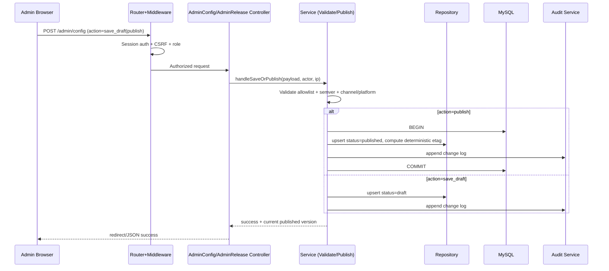
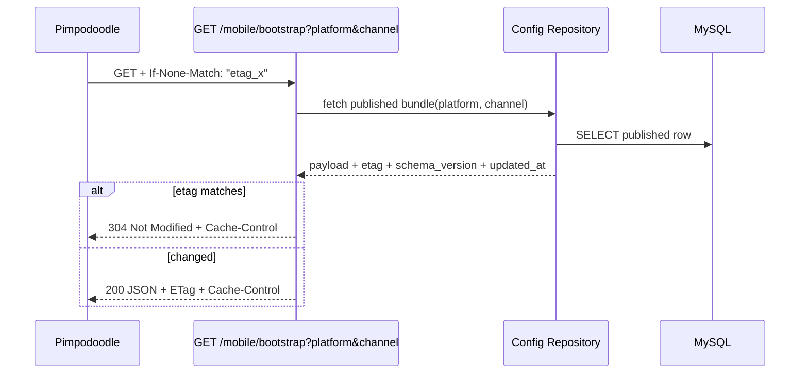
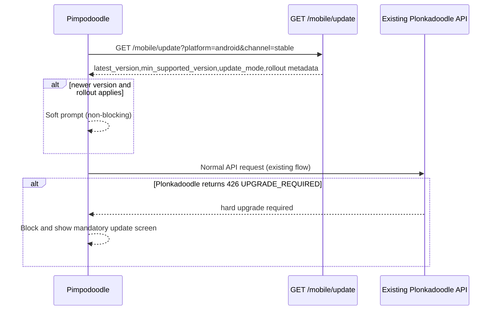

# Ploofoodle Architecture (Phase 0/1 Skeleton)

## Component Diagram
```mermaid
flowchart LR
  subgraph AdminSide[Admin Side]
    B[Admin Browser]
    PAF[Ploofoodle Admin Frontend (PHP Views)]
    PAB[Ploofoodle Backend (Router/Controllers/Services/Repos)]
  end

  subgraph PublicSide[Mobile Public Side]
    M[Pimpodoodle App]
    PUB[Ploofoodle Public Endpoints]
    CACHE[(Optional Edge Cache/CDN)]
  end

  subgraph SharedData[Shared Data]
    DB[(Shared MySQL DB)]
  end

  subgraph ExistingSystem[Existing System]
    PL[Plonkadoodle APIs]
  end

  B -->|Session + CSRF| PAF
  PAF --> PAB
  PAB -->|RW admin_* tables only| DB

  M -->|GET /mobile/bootstrap,/mobile/update| PUB
  CACHE -.cache.-> PUB
  PUB -->|RO admin_* tables| DB

  M -->|normal app APIs| PL
  PL --> DB
```

## Auth/Trust Boundary
```mermaid
flowchart TB
  U1[Public Client] --> EP1[/mobile/bootstrap,/mobile/update]
  U2[Admin User] --> EP2[/admin/*,/auth/*]

  EP1 -->|No Auth| SAFE[Allowlist Output Gate + ETag + Cache Headers]
  EP2 -->|Session + CSRF + Role Check| ADMIN[Admin Controllers]

  SAFE --> DB[(Shared MySQL)]
  ADMIN --> DB
```

## Data Flows

### Admin Edit + Publish (Atomic)


### App Bootstrap Fetch with ETag


### Update Check (Soft Prompt + Plonkadoodle Hard Gate)


## Endpoint Contracts

### Public
- `GET /mobile/bootstrap?platform=&channel=`
- `GET /mobile/update?platform=&channel=`

Response basics:
- `success`, `schema_version`, `platform`, `channel`, `updated_at`, `config|manifest`
- `ETag` deterministic hash
- `Cache-Control: public, max-age=3600, stale-while-revalidate=86400`
- `304` when `If-None-Match` matches current ETag

### Admin (protected)
- `GET/POST /admin/config`
- `GET/POST /admin/releases`
- `GET/POST /auth/login`
- `POST /auth/logout`

Publish behavior:
- validate payload/fields
- compute deterministic ETag
- write published row in transaction
- append audit log in same transaction

## Safety Rules
- Bootstrap publish allowlist keys only:
  - `feature_flags`, `tuning`, `welcome_slides`, `support_links`, `env_label`, `cache_ttl_seconds`
- Unknown keys are rejected.
- `updated_by` is derived from session user server-side.
- Plonkadoodle remains hard-gate authority (`426`).
